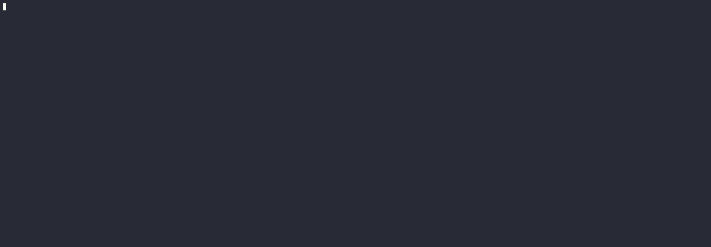
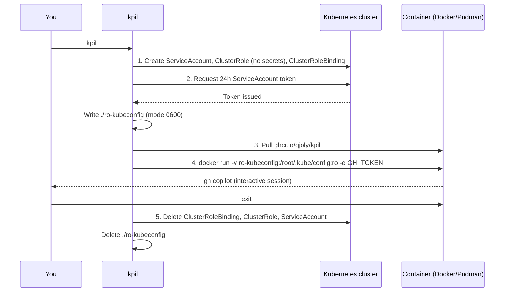

# kpil (Kubernetes + Copilot)

A CLI tool that provisions a scoped, read-only Kubernetes ServiceAccount (secrets excluded), generates a short-lived kubeconfig, and drops you directly into an AI coding agent — **GitHub Copilot CLI**, **Anthropic Claude Code**, or **OpenCode** — inside an isolated container, then cleans everything up when you exit.



---

## How it works



### RBAC design

The `ClusterRole` is built **dynamically** at runtime using the Kubernetes discovery API: every resource in every API group is enumerated from the live cluster and granted `get`, `list`, `watch` — except `secrets`, which are never included.

This means the role works automatically with CRDs and custom API groups without any manual configuration.

| Resource | Name | Scope |
|---|---|---|
| `ServiceAccount` | `copilot-readonly` | namespace |
| `ClusterRole` | `copilot-readonly` | cluster-wide |
| `ClusterRoleBinding` | `copilot-readonly` | cluster-wide |

---

## Requirements

| Requirement | Notes |
|---|---|
| Go 1.21+ | For building from source |
| `docker` or `podman` | Auto-detected; `docker` preferred |
| A kubeconfig with **cluster-admin** | Used only to provision RBAC |
| `GH_TOKEN` env var | Required for `--agent copilot` (default). Fine-grained PAT with `copilot_requests: write` — see [docs/github-pat.md](docs/github-pat.md) |
| A Claude Pro/Max subscription | Required for `--agent claude`. Sign in once via `/login` inside the agent on first run; the session is persisted under `~/.kpil/claude` on the host. `ANTHROPIC_API_KEY` is also honoured if you already have one. |
| A provider account for OpenCode | Required for `--agent opencode`. Run `opencode auth login` on first run to pair a provider (Anthropic, OpenAI, …); the session is persisted under `~/.kpil/opencode` on the host. `ANTHROPIC_API_KEY` / `OPENAI_API_KEY` are forwarded if set. |
| A GitHub Copilot subscription | Required to use the Copilot CLI |
| `cosign` (optional) | Required for image signature verification — see [docs/cosign.md](docs/cosign.md). Use `--insecure-image` to skip. |

---

## Quickstart

### 1. Install

**Homebrew** (macOS and Linux):

```sh
brew tap qjoly/tap
brew install kpil
```

**Krew** (kubectl plugin manager):

```sh
kubectl krew install --manifest-url=https://raw.githubusercontent.com/qjoly/kpil/main/kpil.yaml
kubectl kpil
```

**Pre-built binary** (Linux, macOS, Windows — amd64 / arm64):

```sh
# macOS (arm64)
curl -fsSL https://github.com/qjoly/kpil/releases/latest/download/kpil_latest_darwin_arm64.tar.gz \
  | tar -xz && sudo mv kpil /usr/local/bin/

# Linux (amd64)
curl -fsSL https://github.com/qjoly/kpil/releases/latest/download/kpil_latest_linux_amd64.tar.gz \
  | tar -xz && sudo mv kpil /usr/local/bin/
```

All releases and checksums are on the [Releases page](https://github.com/qjoly/kpil/releases).

**From source:**

```sh
git clone https://github.com/qjoly/kpil.git
cd kpil
go build -o kpil .
```

### 2. Export your AI agent credentials

For **GitHub Copilot** (default), create a fine-grained PAT scoped only to Copilot (see [docs/github-pat.md](docs/github-pat.md)):

```sh
export GH_TOKEN=github_pat_xxxxxxxxxxxx
```

For **Anthropic Claude Code** with a **Claude Pro/Max subscription**, you don't need to set anything up-front. On first run, type `/login` inside the agent to start the OAuth flow; the resulting session is stored in `~/.kpil/claude` on the host and reused on subsequent runs.

```sh
# First run only — completes the /login flow once and persists the session
kpil --agent claude
```

If you happen to have an API key instead, it is also honoured:

```sh
export ANTHROPIC_API_KEY=sk-ant-xxxxxxxxxxxx
```

For **OpenCode**, run `opencode auth login` inside the agent on first run to authenticate with your preferred provider; the session is persisted in `~/.kpil/opencode` on the host. `ANTHROPIC_API_KEY` and `OPENAI_API_KEY` are forwarded into the container if set.

### 3. Run

```sh
# GitHub Copilot (default)
kpil

# Claude Code
kpil --agent claude

# OpenCode
kpil --agent opencode
```

The tool connects to the cluster in your current `KUBECONFIG`, provisions the RBAC resources, generates a restricted kubeconfig, and opens the selected agent. When you exit, everything is deleted automatically.

---

## Usage

```
kpil [flags]

Flags:
      --agent string           AI agent: "copilot", "claude", or "opencode" (default "copilot")
      --claude-config string   Host directory mounted at /root/.claude to persist the
                               Claude Code subscription session (default: $HOME/.kpil/claude)
      --opencode-config string Host directory backing OpenCode's data + config dirs in
                               the container (default: $HOME/.kpil/opencode)
      --build                  Build the image from the local Dockerfile instead of pulling
      --image string     Container image to run
                         (default "ghcr.io/qjoly/kpil:latest")
      --insecure-image   Skip cosign signature verification (unsigned or local images)
      --kubeconfig       Admin kubeconfig path
                         (default: $KUBECONFIG or ~/.kube/config)
      --namespace        Namespace for the ServiceAccount  (default "default")
      --no-cleanup       Skip deleting RBAC resources and kubeconfig on exit
      --out string       Path for the generated RO kubeconfig  (default "./ro-kubeconfig")
      --runtime string   Container runtime: docker or podman  (default: auto-detect)
      --sa-name string   Name of the SA / ClusterRole / CRB  (default "copilot-readonly")
      --token-ttl        ServiceAccount token lifetime  (default 24h)
  -h, --help
```

### Examples

```sh
# Launch Claude Code instead of GitHub Copilot (subscription auth — run /login on first launch)
kpil --agent claude

# Launch OpenCode (run `opencode auth login` on first launch to pair a provider)
kpil --agent opencode

# Use a specific kubeconfig and namespace
kpil --kubeconfig ~/.kube/staging --namespace platform

# Use podman explicitly
kpil --runtime podman

# Use a specific image tag (e.g. a commit build)
kpil --image ghcr.io/qjoly/kpil:sha-538cd59

# Keep RBAC resources after exit (for debugging)
kpil --no-cleanup

# Build the image locally instead of pulling (skips signature verification)
GH_TOKEN=$GH_TOKEN kpil --build

# Use an unsigned or locally-built image (skips cosign verification)
kpil --insecure-image
```

---

## Container image

Images are published to [ghcr.io/qjoly/kpil](https://github.com/qjoly/kpil/pkgs/container/kpil).

| Tag | Updated on |
|---|---|
| `latest` | Release tag (`v*`) |
| `v1.2.3` | Release tag — immutable |
| `edge` | Every commit to `main` |
| `sha-<7chars>` | Every commit to `main` — immutable |

The image contains:

- `kubectl` (latest stable at build time)
- `gh` CLI (latest stable at build time)
- `gh copilot` extension (pre-installed at build time — no token needed at build)
- GitHub Copilot standalone CLI (`copilot` binary)
- Anthropic Claude Code CLI (`claude`, installed via npm)
- OpenCode CLI (`opencode`, installed via npm)

The image requires **no token at build time**. `GH_TOKEN` is only needed at runtime and is forwarded automatically from your shell environment.

### Image signatures

Every image published to `ghcr.io` is signed with
[cosign keyless signing](docs/cosign.md) via GitHub Actions OIDC.  The CLI
verifies the signature automatically before starting the container — no
configuration needed as long as `cosign` is in your `PATH`.

```sh
# Verification happens automatically:
kpil

# Skip verification for unsigned or locally-built images:
kpil --insecure-image
```

See **[docs/cosign.md](docs/cosign.md)** for full details on how signing works,
manual verification, and troubleshooting.

### Build locally

```sh
docker build -t kpil:local .
```

---

## Cleanup behaviour

On exit — whether the user types `exit`, closes the terminal, or hits Ctrl+C — the tool:

1. Deletes the `ClusterRoleBinding`
2. Deletes the `ClusterRole`
3. Deletes the `ServiceAccount`
4. Deletes the `ro-kubeconfig` file from disk

If provisioning fails partway through, only the resources that were actually created are deleted. Use `--no-cleanup` to skip this (e.g. to inspect what was created).

---

## GitHub token

A fine-grained PAT with a single permission is sufficient:

| Permission | Level |
|---|---|
| `copilot_requests` (account) | `write` |

No repository or organisation permissions are needed. See **[docs/github-pat.md](docs/github-pat.md)** for step-by-step instructions and a pre-filled token creation URL.

---

## Development

```sh
# Run directly
go run main.go

# Build
go build -o kpil .

# Vet
go vet ./...
```

### CI / CD

| Workflow | Trigger | Action |
|---|---|---|
| `ci.yml` | Push / PR to `main` | Build, vet, GoReleaser check, push `sha-*` + `edge` Docker image, sign image with cosign |
| `release.yml` | Push `v*` tag | Push versioned Docker image, sign image with cosign, create GitHub Release with binaries |

To cut a release:

```sh
git tag v0.1.0
git push origin v0.1.0
```

---

## Project structure

```
.
├── main.go                        Entry point
├── cmd/
│   └── root.go                    Cobra CLI, flags, lifecycle orchestration
├── internal/
│   ├── k8s/
│   │   ├── client.go              Kubernetes client setup
│   │   ├── rbac.go                ServiceAccount + ClusterRole + CRB (create / delete)
│   │   └── kubeconfig.go          TokenRequest + kubeconfig file generation
│   └── container/
│       └── runner.go              Image detection, pull, build, run, signal forwarding
├── Dockerfile                     Node.js 20 + gh CLI + kubectl
├── entrypoint.sh                  Checks GH_TOKEN and execs gh copilot suggest
├── .goreleaser.yaml               Cross-platform binary release config
├── .github/workflows/
│   ├── ci.yml                     CI + edge Docker image
│   └── release.yml                Versioned release
└── docs/
    ├── cosign.md              Image signature verification guide
    └── github-pat.md          Fine-grained PAT guide
```

---

## License

MIT
