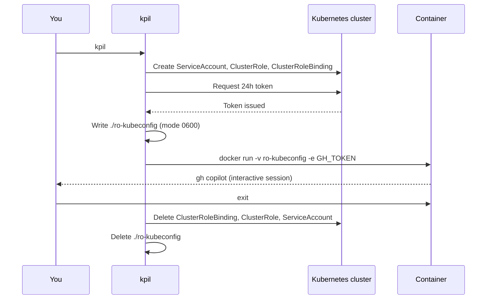

## Requirements

| Requirement | Notes |
|---|---|
| `docker` or `podman` | Auto-detected; Docker preferred |
| Admin kubeconfig | Needs cluster-admin to provision RBAC |
| `GH_TOKEN` env var | Fine-grained PAT with `copilot_requests: write` |
| GitHub Copilot subscription | Required to use the Copilot CLI |
| `cosign` (optional) | For image signature verification — use `--insecure-image` to skip |

## Installation

### Homebrew

```sh
brew tap qjoly/tap
brew install kpil
```

### Krew

```sh
kubectl krew install --manifest-url=https://raw.githubusercontent.com/qjoly/kpil/main/kpil.yaml
```

### Pre-built binary

Download from the [Releases page](https://github.com/qjoly/kpil/releases) and place the binary in your `PATH`.

### From source

```sh
git clone https://github.com/qjoly/kpil.git
cd kpil
go build -o kpil .
```

## Usage

### 1. Set your GitHub token

Create a fine-grained PAT with `copilot_requests: write` (see [GitHub Token](github-token)):

```sh
export GH_TOKEN=github_pat_xxxxxxxxxxxx
```

### 2. Run

```sh
kpil
```

kpil will:
1. Connect to your current `KUBECONFIG` cluster
2. Create a `ServiceAccount`, `ClusterRole` (no secrets), and `ClusterRoleBinding`
3. Issue a 24h token and write `./ro-kubeconfig`
4. Pull and start the container with the read-only kubeconfig mounted
5. On exit, delete all RBAC resources and the kubeconfig

## How it works


