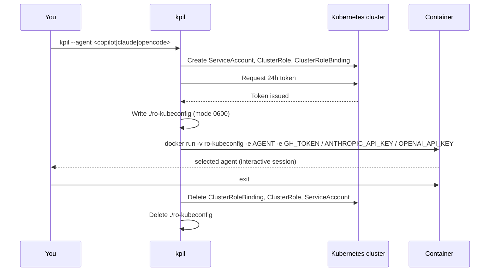

## Requirements

| Requirement | Notes |
|---|---|
| `docker` or `podman` | Auto-detected; Docker preferred |
| Admin kubeconfig | Needs cluster-admin to provision RBAC |
| `cosign` (optional) | For image signature verification — use `--insecure-image` to skip |
| Agent credentials | Depends on `--agent` — see the per-agent rows below |

| `--agent` value | What it runs | Auth needed |
|---|---|---|
| `copilot` *(default)* | [GitHub Copilot CLI](github-token) | `GH_TOKEN` (fine-grained PAT with `copilot_requests: write`) + an active Copilot subscription |
| `claude` | [Anthropic Claude Code](claude) | Claude Pro/Max subscription via `claude /login` on first run, or `ANTHROPIC_API_KEY` |
| `opencode` | [sst/opencode](opencode) | Provider auth via `opencode auth login` on first run, or `ANTHROPIC_API_KEY` / `OPENAI_API_KEY` |

## Installation

### Homebrew

```sh
brew tap qjoly/tap
brew install kpil
```

### Krew

```sh
kubectl krew install --manifest-url=https://raw.githubusercontent.com/qjoly/kpil/main/kpil.yaml
```

### Pre-built binary

Download from the [Releases page](https://github.com/qjoly/kpil/releases) and place the binary in your `PATH`.

### From source

```sh
git clone https://github.com/qjoly/kpil.git
cd kpil
go build -o kpil .
```

## Usage

### 1. Pick an agent and provide credentials

**Copilot** (default) — set a fine-grained PAT with `copilot_requests: write` (details on the [GitHub Token](github-token) page):

```sh
export GH_TOKEN=github_pat_xxxxxxxxxxxx
kpil                          # --agent copilot is implicit
```

**Claude Code** — no env var needed up front. On first run, type `/login` inside the agent to authenticate your Claude Pro/Max subscription. The OAuth session is persisted in `~/.kpil/claude` and reused on every subsequent run. See [Claude Code](claude).

```sh
kpil --agent claude
```

**OpenCode** — on first run, type `opencode auth login` inside the agent to pair a provider (Anthropic, OpenAI, …). The session is persisted in `~/.kpil/opencode` and reused next time. See [OpenCode](opencode).

```sh
kpil --agent opencode
```

If you already have an `ANTHROPIC_API_KEY` or `OPENAI_API_KEY` exported, kpil forwards them into the container automatically — handy for non-subscription flows.

### 2. What happens

kpil will:
1. Connect to your current `KUBECONFIG` cluster
2. Create a `ServiceAccount`, `ClusterRole` (no secrets), and `ClusterRoleBinding`
3. Issue a 24h token and write `./ro-kubeconfig`
4. Pull (or build) and start the container with the read-only kubeconfig mounted
5. Launch the requested agent
6. On exit, delete all RBAC resources and the kubeconfig

## How it works


```mermaid
sequenceDiagram
    participant U as You
    participant K as kpil
    participant C as Kubernetes cluster
    participant D as Container

    U->>K: kpil --agent <copilot|claude|opencode>
    K->>C: Create ServiceAccount, ClusterRole, ClusterRoleBinding
    K->>C: Request 24h token
    C-->>K: Token issued
    K->>K: Write ./ro-kubeconfig (mode 0600)
    K->>D: docker run -v ro-kubeconfig -e AGENT -e GH_TOKEN / ANTHROPIC_API_KEY / OPENAI_API_KEY
    D-->>U: selected agent (interactive session)
    U->>D: exit
    K->>C: Delete ClusterRoleBinding, ClusterRole, ServiceAccount
    K->>K: Delete ./ro-kubeconfig
```
